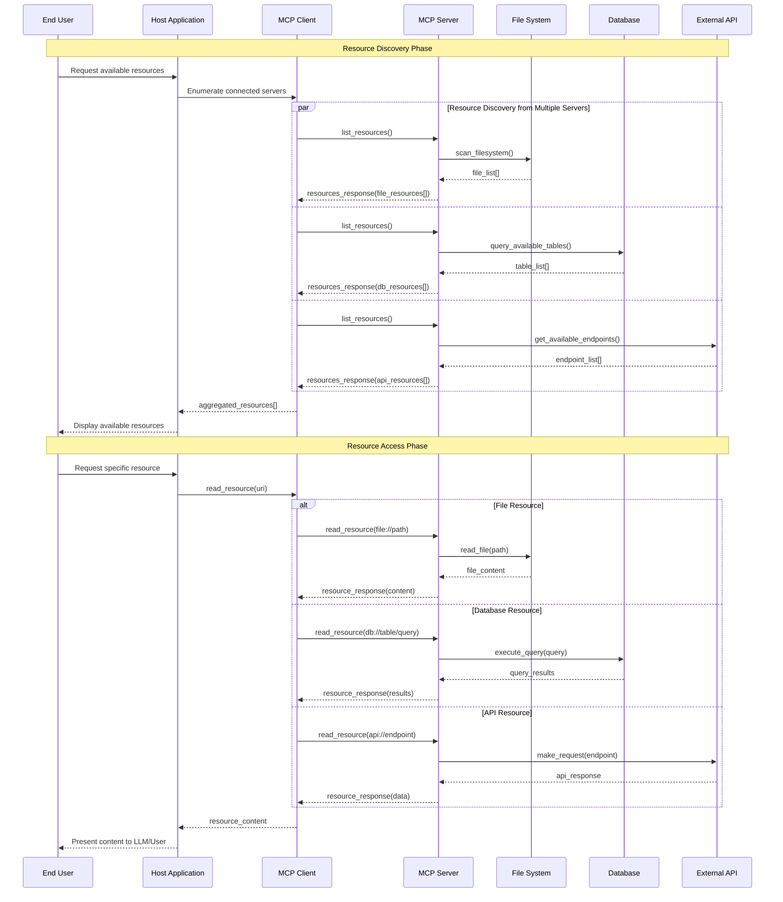
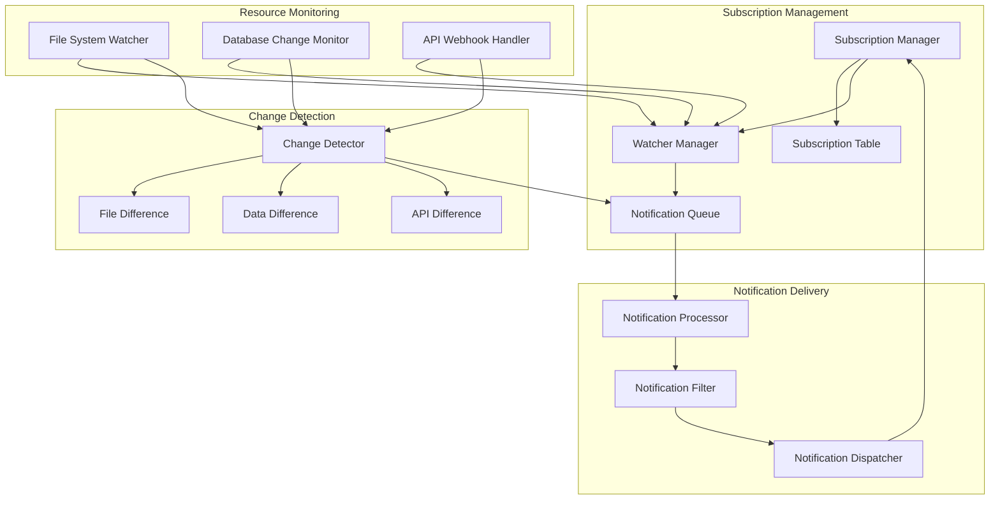
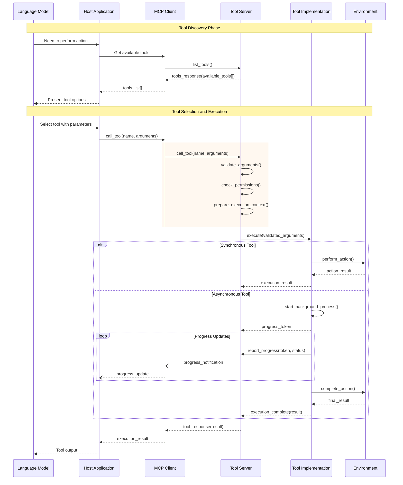
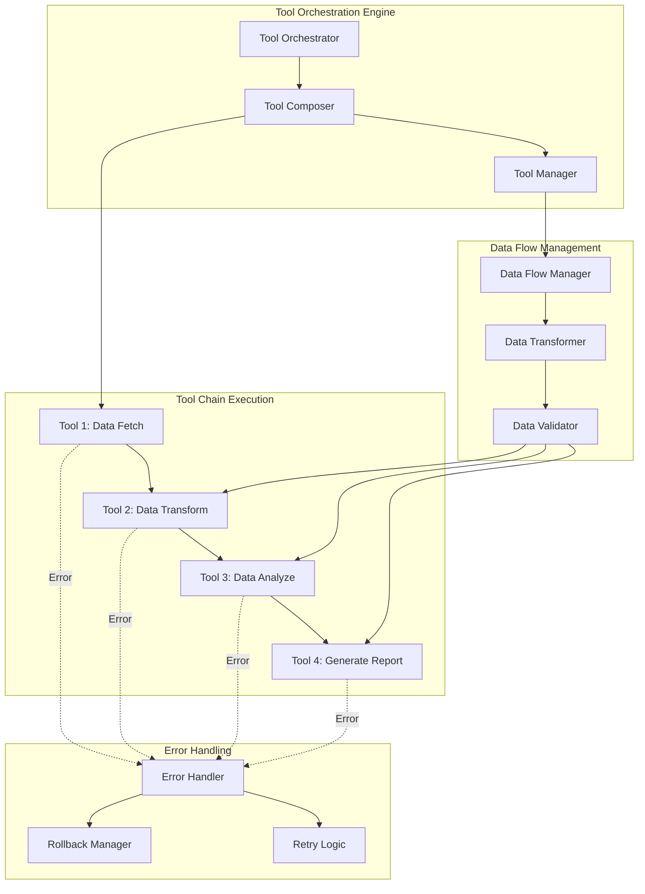
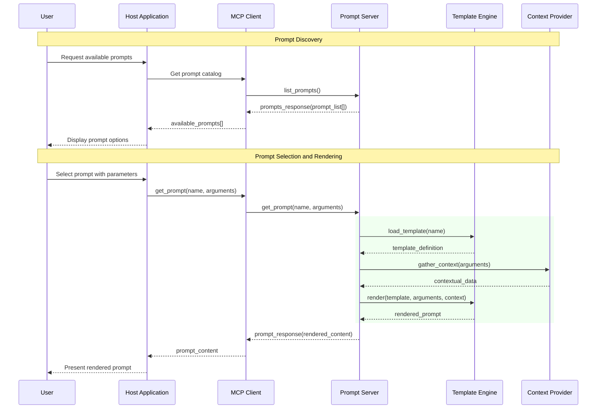
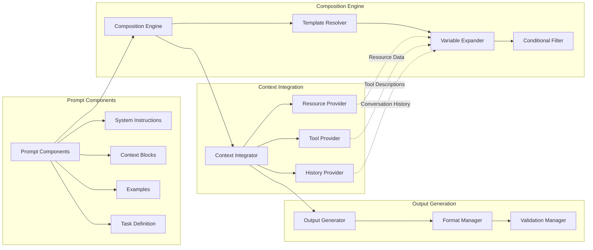
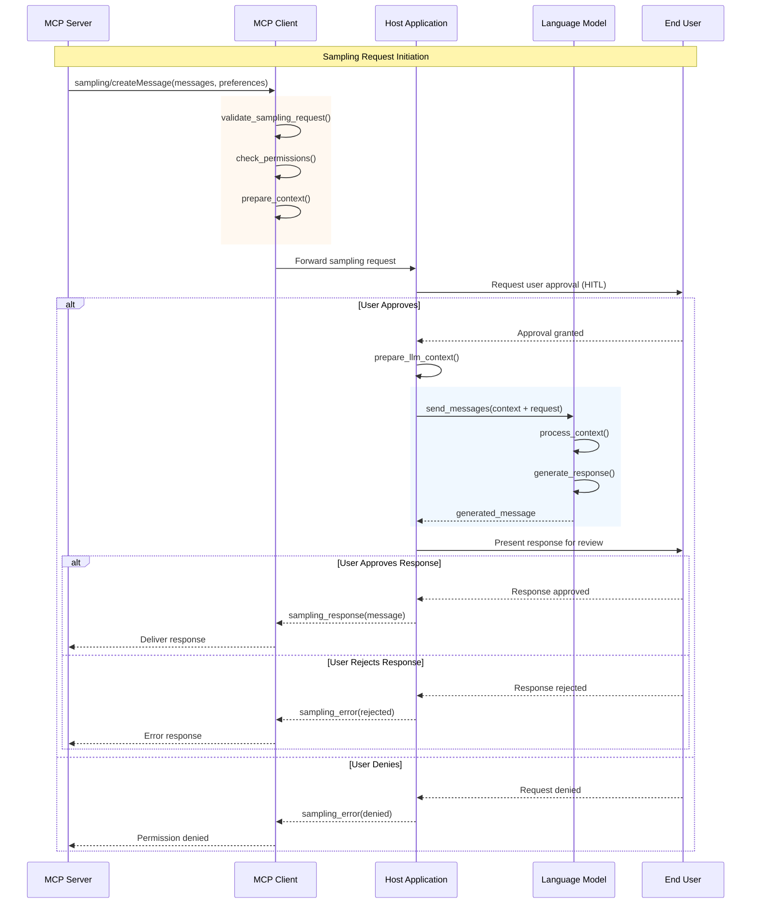
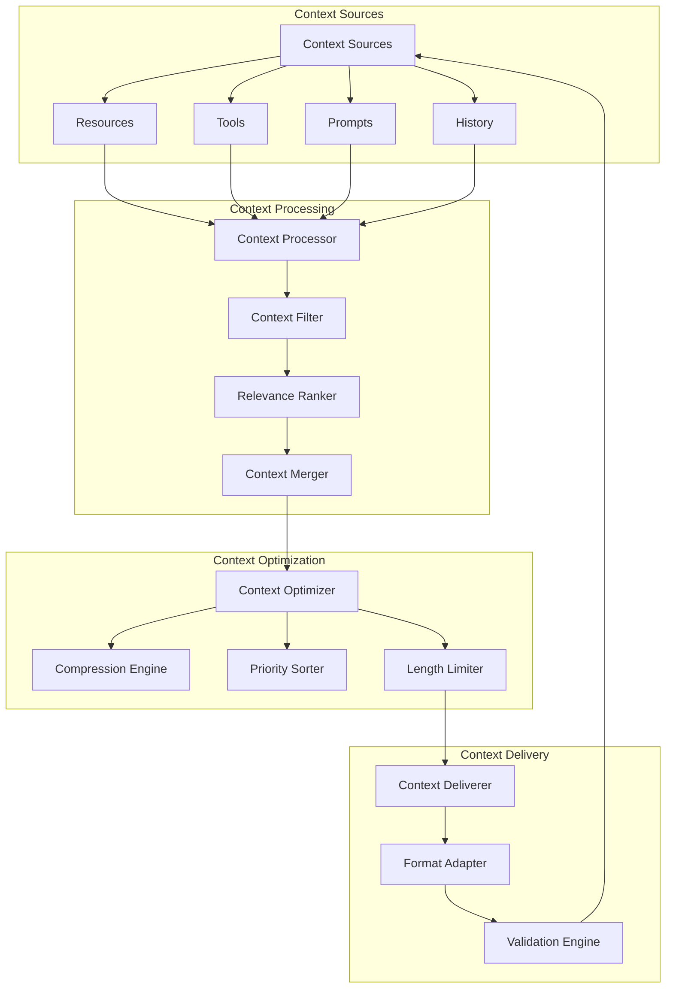
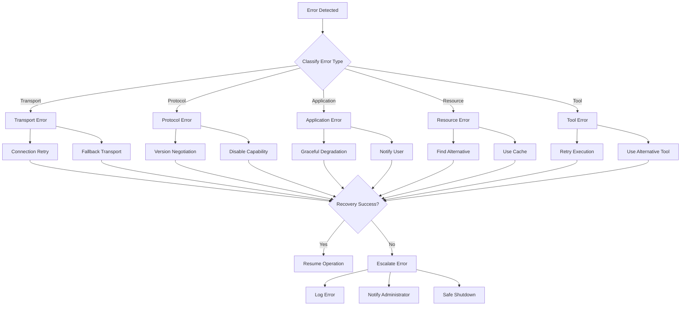

This document provides detailed visual representations of how data flows through the MCP system and how different components interact with each other during various operations.

## Resource Management Flow

### Resource Discovery and Access Pattern

### Resource Subscription and Update Flow

## Tool Execution Patterns

### Tool Discovery and Execution Flow

### Tool Chaining and Composition

## Prompt Template Processing

### Prompt Discovery and Rendering Flow

### Dynamic Prompt Composition

## Sampling and Context Integration

### LLM Sampling Request Flow

### Context Aggregation and Synthesis

## Error Propagation and Recovery

### Error Classification and Handling

This comprehensive data flow documentation illustrates how information moves through the MCP ecosystem and how different components coordinate to provide seamless context integration and tool execution capabilities.
