

The Model Context Protocol (MCP) follows a client-host-server architecture where each
host can run multiple client instances. This architecture enables users to integrate AI
capabilities across applications while maintaining clear security boundaries and
isolating concerns. Built on JSON-RPC, MCP provides a stateful session protocol focused
on context exchange and sampling coordination between clients and servers.

## System Overview

The following diagram provides a comprehensive view of the MCP ecosystem, showing how different components interact and the flow of data through the system:

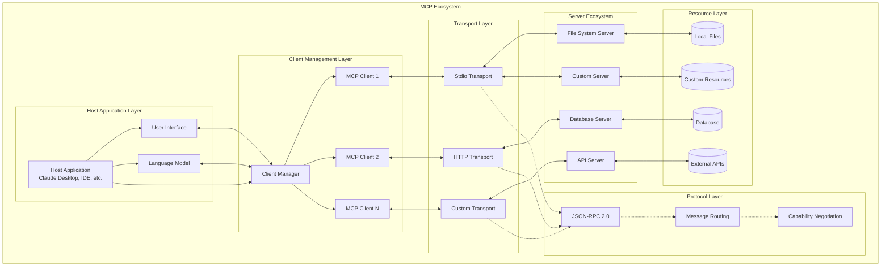

## Core Components

The MCP architecture consists of several interconnected layers that work together to provide seamless context integration:

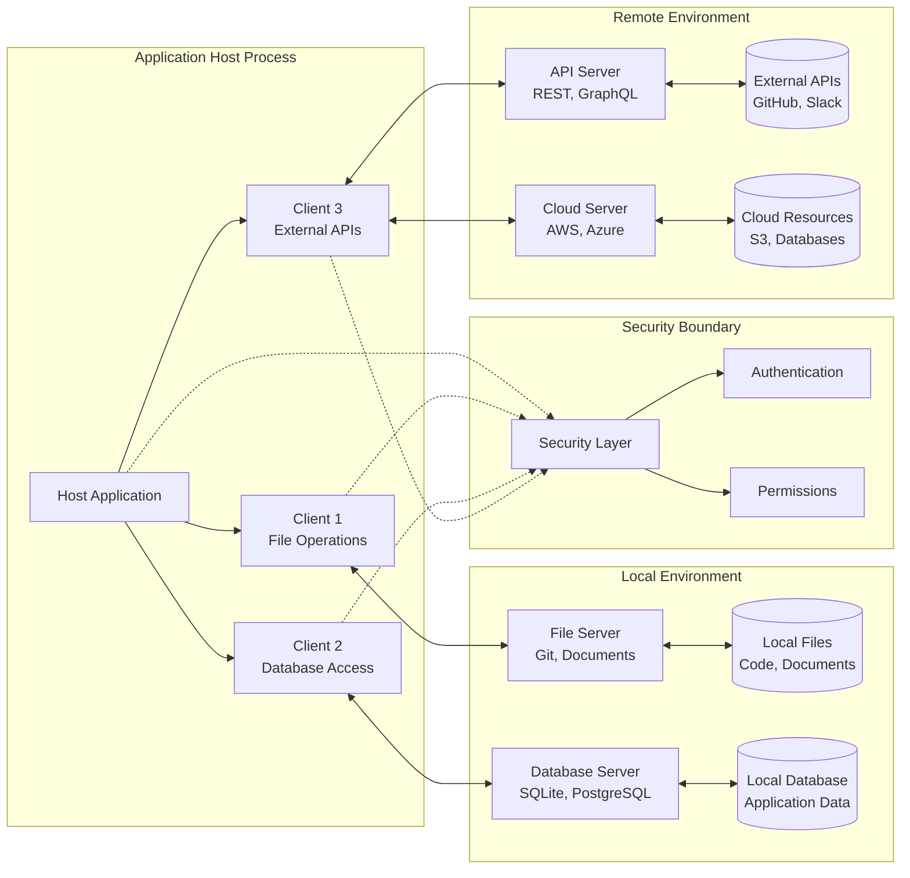

### Detailed Component Interaction

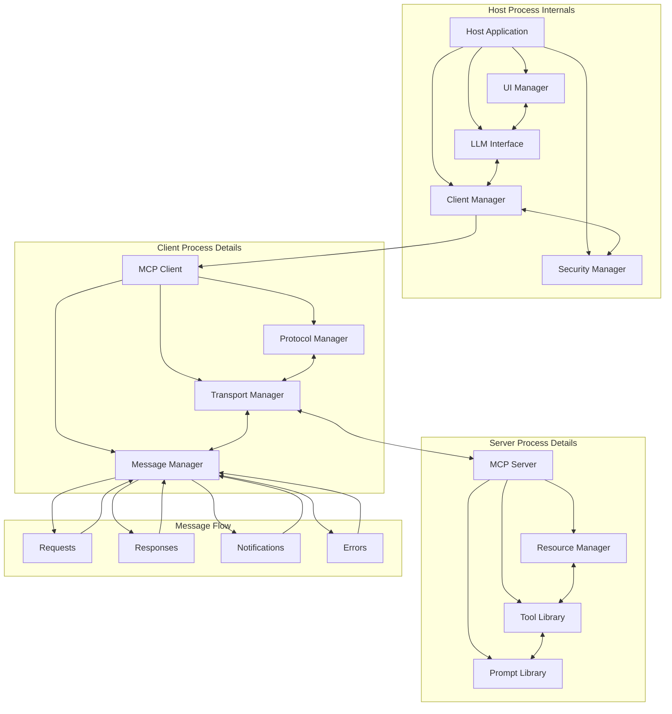

### Host

The host process acts as the container and coordinator:

- Creates and manages multiple client instances
- Controls client connection permissions and lifecycle
- Enforces security policies and consent requirements
- Handles user authorization decisions
- Coordinates AI/LLM integration and sampling
- Manages context aggregation across clients

### Clients

Each client is created by the host and maintains an isolated server connection:

- Establishes one stateful session per server
- Handles protocol negotiation and capability exchange
- Routes protocol messages bidirectionally
- Manages subscriptions and notifications
- Maintains security boundaries between servers

A host application creates and manages multiple clients, with each client having a 1:1
relationship with a particular server.

### Servers

Servers provide specialized context and capabilities:

- Expose resources, tools and prompts via MCP primitives
- Operate independently with focused responsibilities
- Request sampling through client interfaces
- Must respect security constraints
- Can be local processes or remote services

## Design Principles

MCP is built on several key design principles that inform its architecture and
implementation:

1. **Servers should be extremely easy to build**

   - Host applications handle complex orchestration responsibilities
   - Servers focus on specific, well-defined capabilities
   - Simple interfaces minimize implementation overhead
   - Clear separation enables maintainable code

2. **Servers should be highly composable**

   - Each server provides focused functionality in isolation
   - Multiple servers can be combined seamlessly
   - Shared protocol enables interoperability
   - Modular design supports extensibility

3. **Servers should not be able to read the whole conversation, nor "see into" other
   servers**

   - Servers receive only necessary contextual information
   - Full conversation history stays with the host
   - Each server connection maintains isolation
   - Cross-server interactions are controlled by the host
   - Host process enforces security boundaries

4. **Features can be added to servers and clients progressively**
   - Core protocol provides minimal required functionality
   - Additional capabilities can be negotiated as needed
   - Servers and clients evolve independently
   - Protocol designed for future extensibility
   - Backwards compatibility is maintained

## Protocol Message Flow

The MCP protocol supports various message patterns for different types of communication. Understanding these flows is crucial for implementing robust MCP systems:

### Message Type Hierarchy

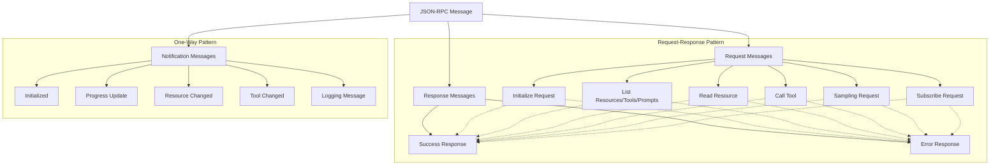

### Complete Protocol Flow Sequence

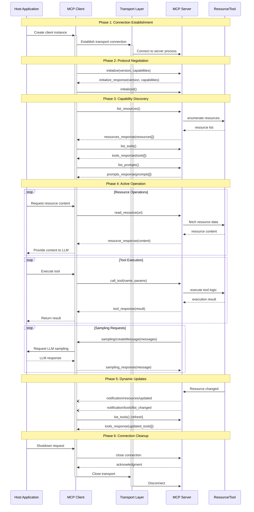

## Capability Negotiation

The Model Context Protocol uses a capability-based negotiation system where clients and
servers explicitly declare their supported features during initialization. Capabilities
determine which protocol features and primitives are available during a session.

- Servers declare capabilities like resource subscriptions, tool support, and prompt
  templates
- Clients declare capabilities like sampling support and notification handling
- Both parties must respect declared capabilities throughout the session
- Additional capabilities can be negotiated through extensions to the protocol

### Connection State Machine

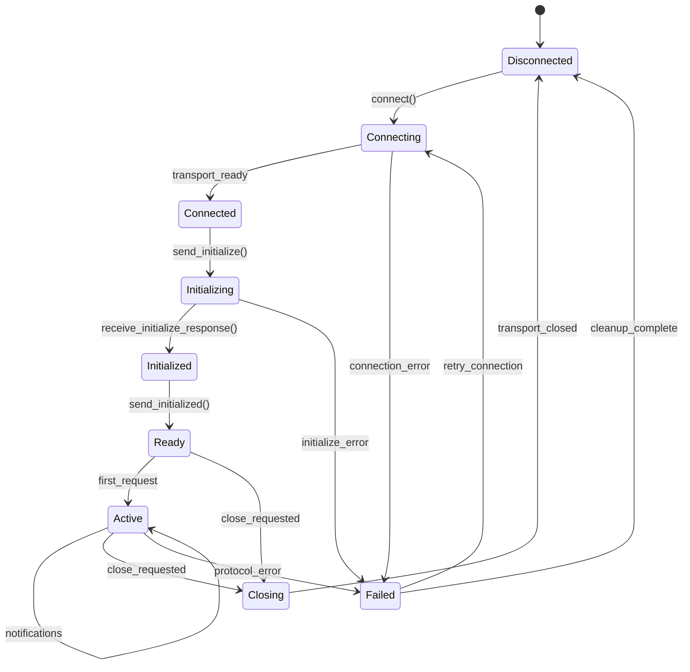

### Capability Exchange Flow

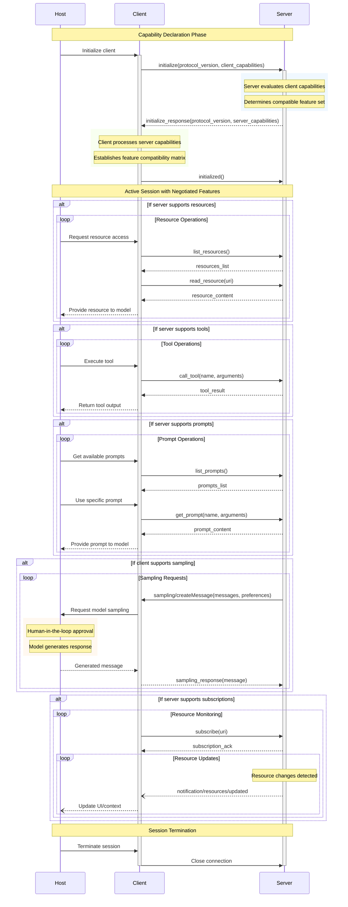

Each capability unlocks specific protocol features for use during the session. For
example:

- Implemented [server features](/specification/draft/server) must be advertised in the
  server's capabilities
- Emitting resource subscription notifications requires the server to declare
  subscription support
- Tool invocation requires the server to declare tool capabilities
- [Sampling](/specification/draft/client) requires the client to declare support in its
  capabilities

This capability negotiation ensures clients and servers have a clear understanding of
supported functionality while maintaining protocol extensibility.

## Transport Layer Architecture

MCP supports multiple transport mechanisms, each optimized for different deployment scenarios. The transport layer provides the foundation for all protocol communication:

### Transport Type Overview

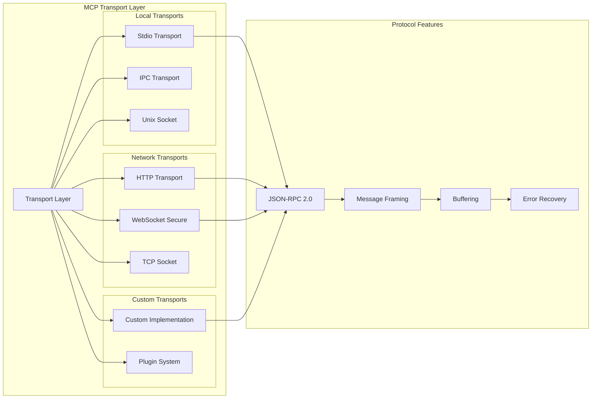

### Transport Selection Matrix

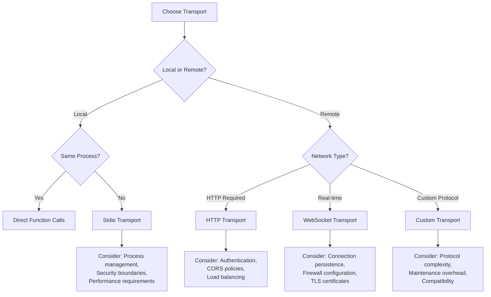

### Message Flow Through Transport Layer

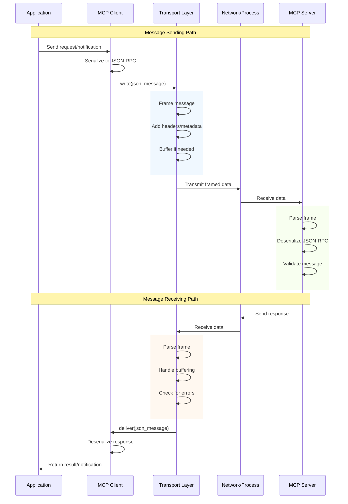

## Error Handling and Recovery Patterns

Robust error handling is essential for reliable MCP implementations. The following diagrams illustrate error scenarios and recovery strategies:

### Error Classification and Flow

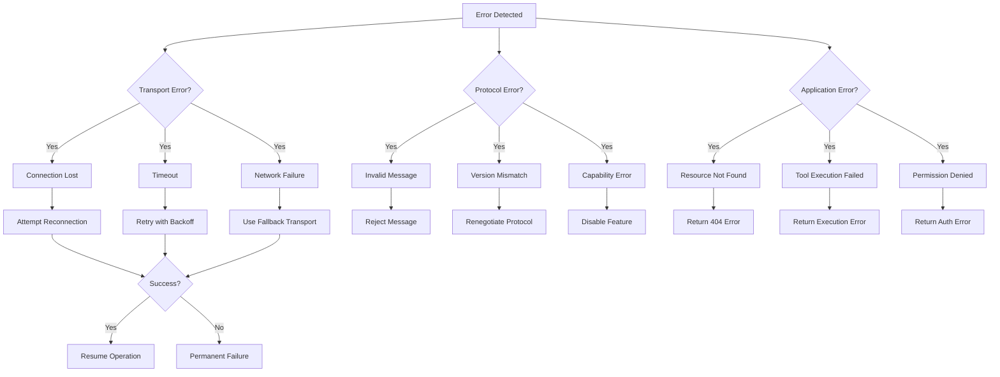

### Error Recovery State Machine

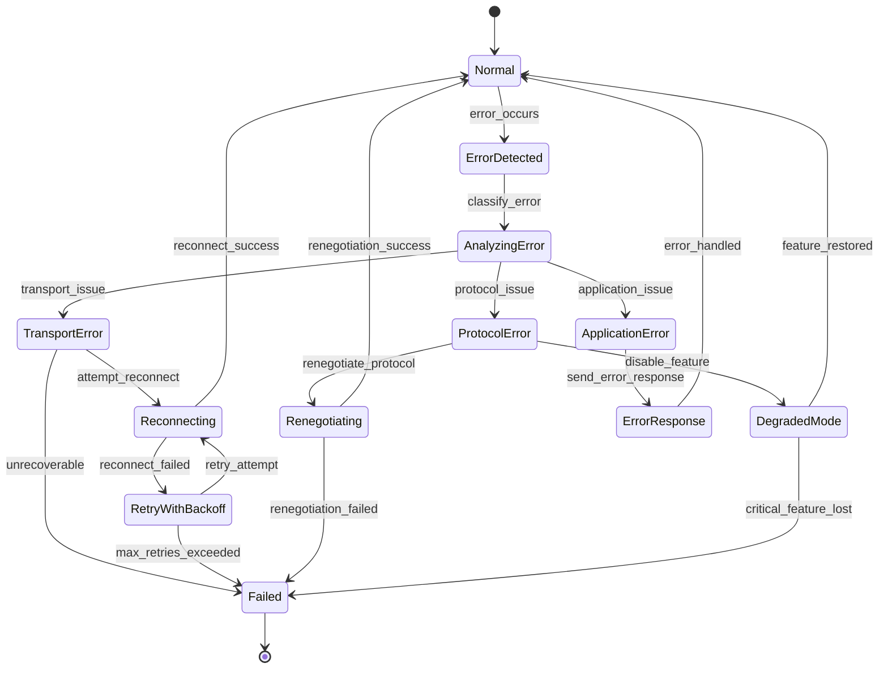

## Architecture Documentation Index

This architecture section provides comprehensive documentation of the Model Context Protocol through multiple perspectives:

### Core Architecture

- **[Architecture Overview](/specification/draft/architecture/)** - This document provides the foundational understanding of MCP's client-host-server architecture, core components, and design principles.

### Advanced Patterns

- **[Advanced Architecture Patterns](/specification/draft/architecture/patterns)** - Explores cognitive flow patterns, neural-symbolic integration, hypergraph communication, and recursive implementation pathways that enable emergent behaviors.

### Data Flow and Interactions

- **[Data Flow and Component Interactions](/specification/draft/architecture/dataflow)** - Detailed sequence diagrams showing how resources, tools, prompts, and sampling requests flow through the system.

### State Management

- **[State Machines and Lifecycle Management](/specification/draft/architecture/states)** - Comprehensive state machine diagrams covering connection lifecycles, capability management, and operational states.

## Key Architectural Insights

The MCP architecture exhibits several emergent properties that make it particularly suited for AI and cognitive computing applications:

1. **Recursive Composability**: Components can be nested and composed at multiple levels, enabling fractal scaling from individual processes to global networks.

2. **Adaptive Capability Negotiation**: The protocol dynamically adjusts available features based on client-server capabilities, ensuring optimal functionality within constraints.

3. **Hypergraph Communication Patterns**: Beyond simple client-server connections, MCP enables complex multi-node interaction patterns that mirror cognitive networks.

4. **Neural-Symbolic Bridge**: MCP provides integration points between symbolic reasoning systems and neural processing, enabling hybrid AI architectures.

5. **Emergent Context Integration**: The combination of resources, tools, and prompts creates emergent context that is greater than the sum of its parts.

6. **Self-Modifying Protocol Patterns**: The architecture supports evolution and adaptation through recursive feedback loops and optimization mechanisms.

These patterns position MCP as not just a protocol for context sharing, but as a foundation for building sophisticated distributed cognitive systems that can adapt, learn, and exhibit emergent intelligence.
