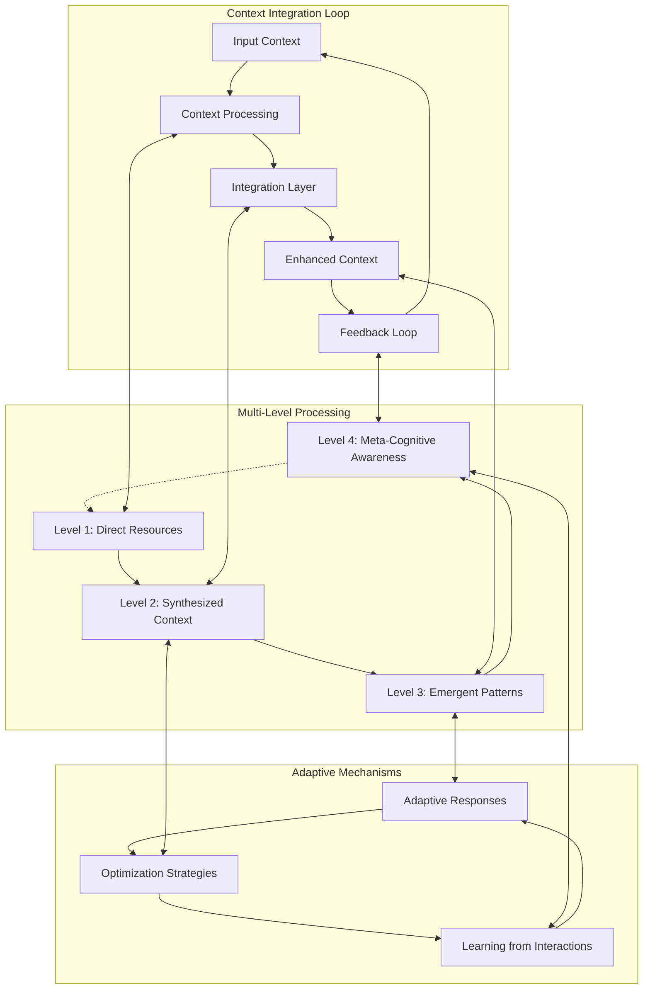
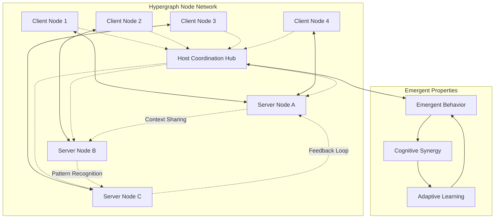
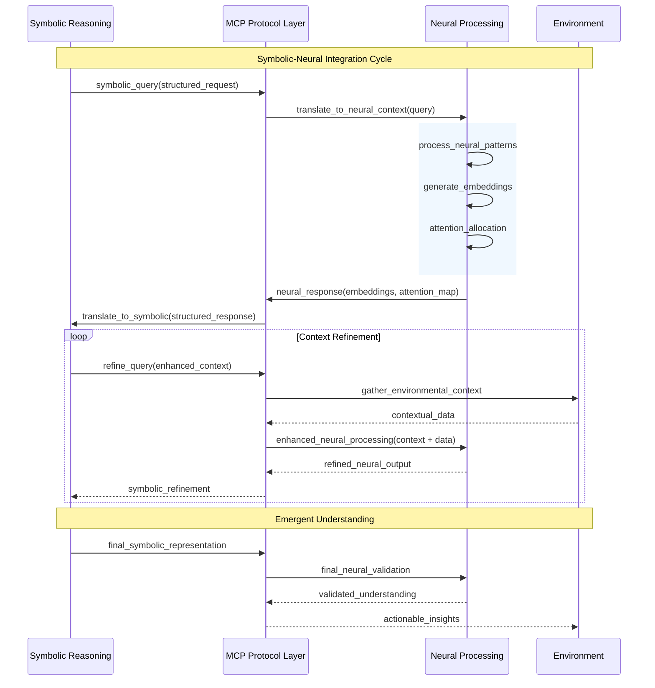
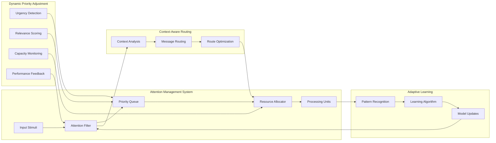
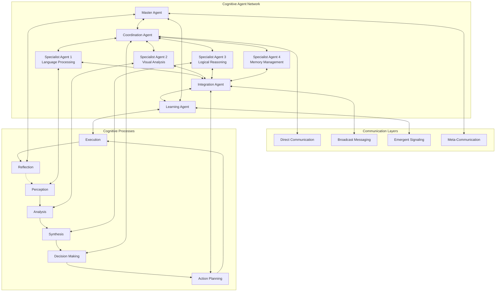
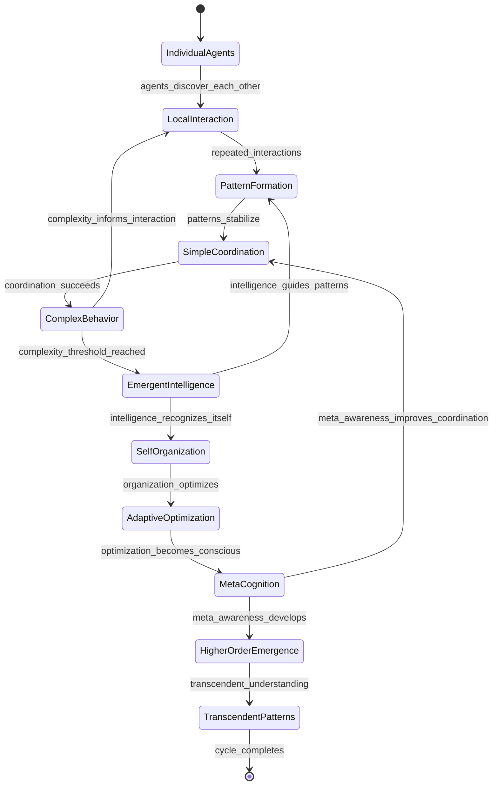
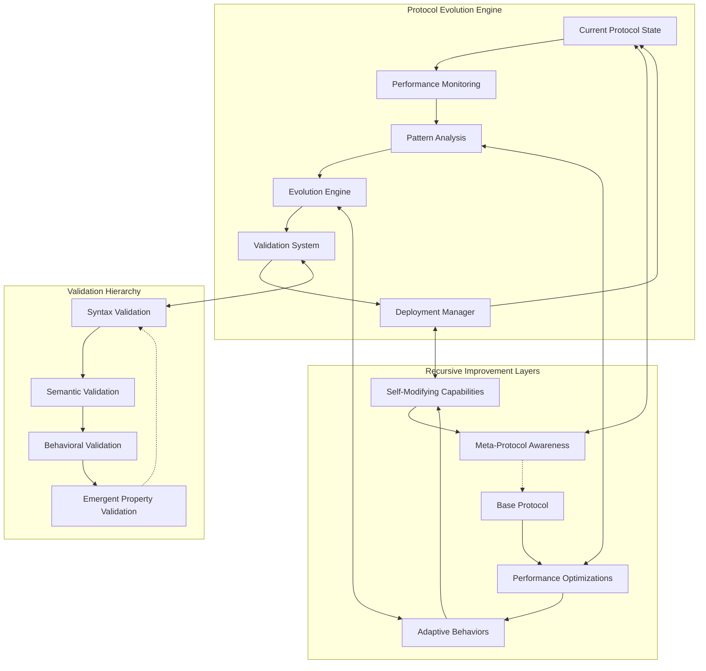
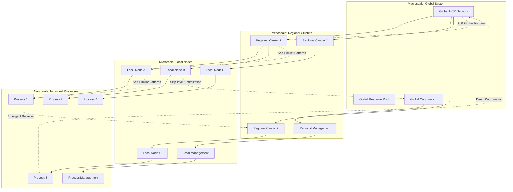
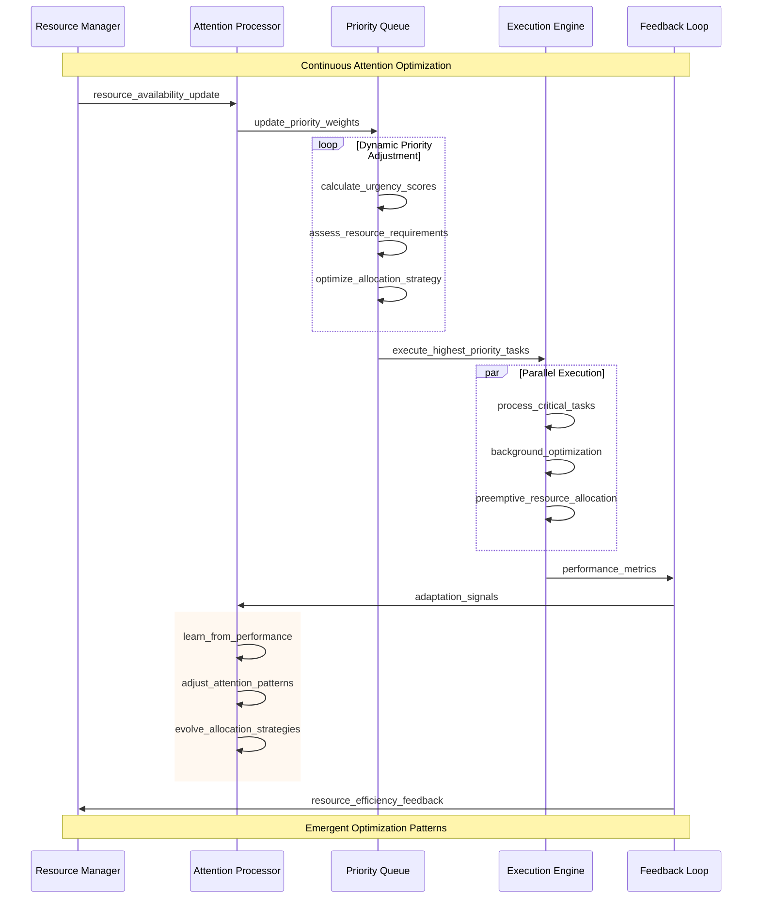
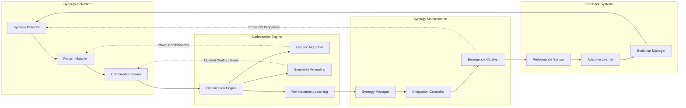

This document explores advanced architectural patterns within the Model Context Protocol ecosystem, illustrating emergent behaviors, recursive patterns, and sophisticated interaction models that enable distributed cognitive processing.

## Cognitive Flow Patterns

The MCP architecture exhibits recursive and emergent patterns that mirror cognitive processes. These patterns enable sophisticated context integration and adaptive behavior.

### Recursive Context Integration

### Hypergraph Communication Patterns

## Neural-Symbolic Integration Points

MCP bridges symbolic reasoning and neural processing through strategic integration points:

### Symbolic-Neural Bridge Architecture

### Attention Allocation Mechanisms

## Distributed Cognitive Architectures

### Multi-Agent Coordination Patterns

### Emergent Behavior Manifestation

## Recursive Implementation Pathways

### Self-Modifying Protocol Patterns

### Fractal Architecture Scaling

## Adaptive Attention Allocation

### Dynamic Resource Management

### Cognitive Synergy Optimization

This advanced architecture documentation reveals the deep structural patterns and emergent behaviors that make MCP a powerful foundation for distributed cognitive systems. The recursive nature of these patterns enables continuous evolution and optimization, while the hypergraph communication model supports sophisticated information integration across multiple scales and domains.
