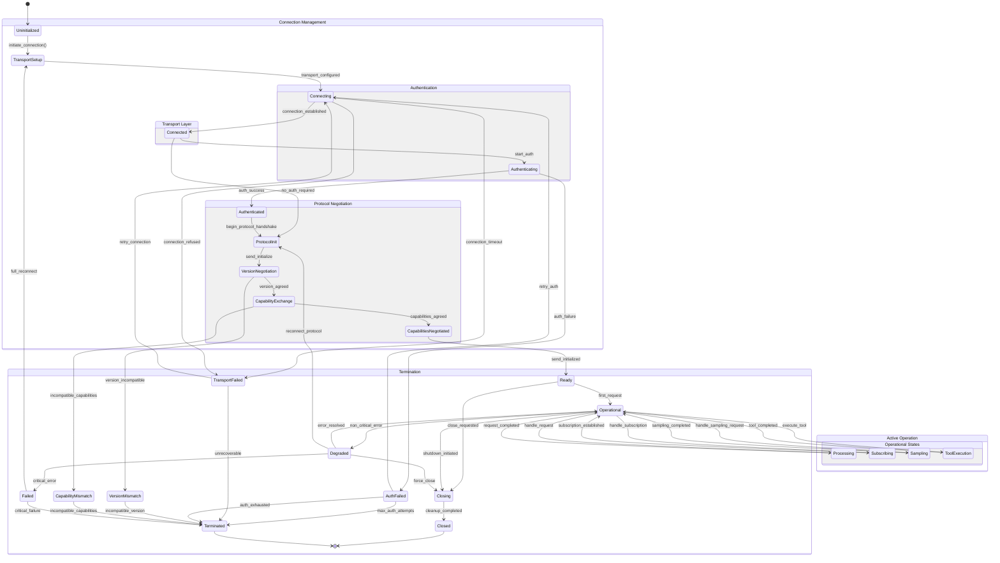
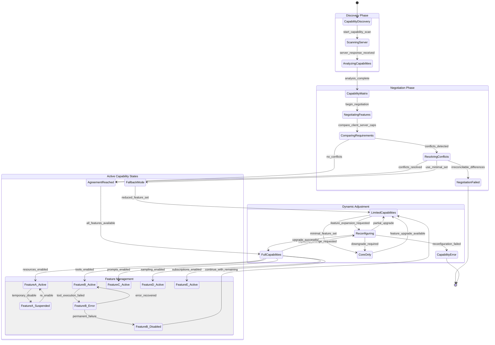
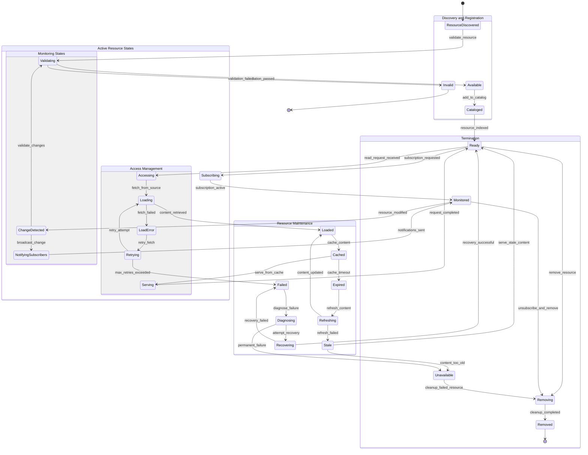
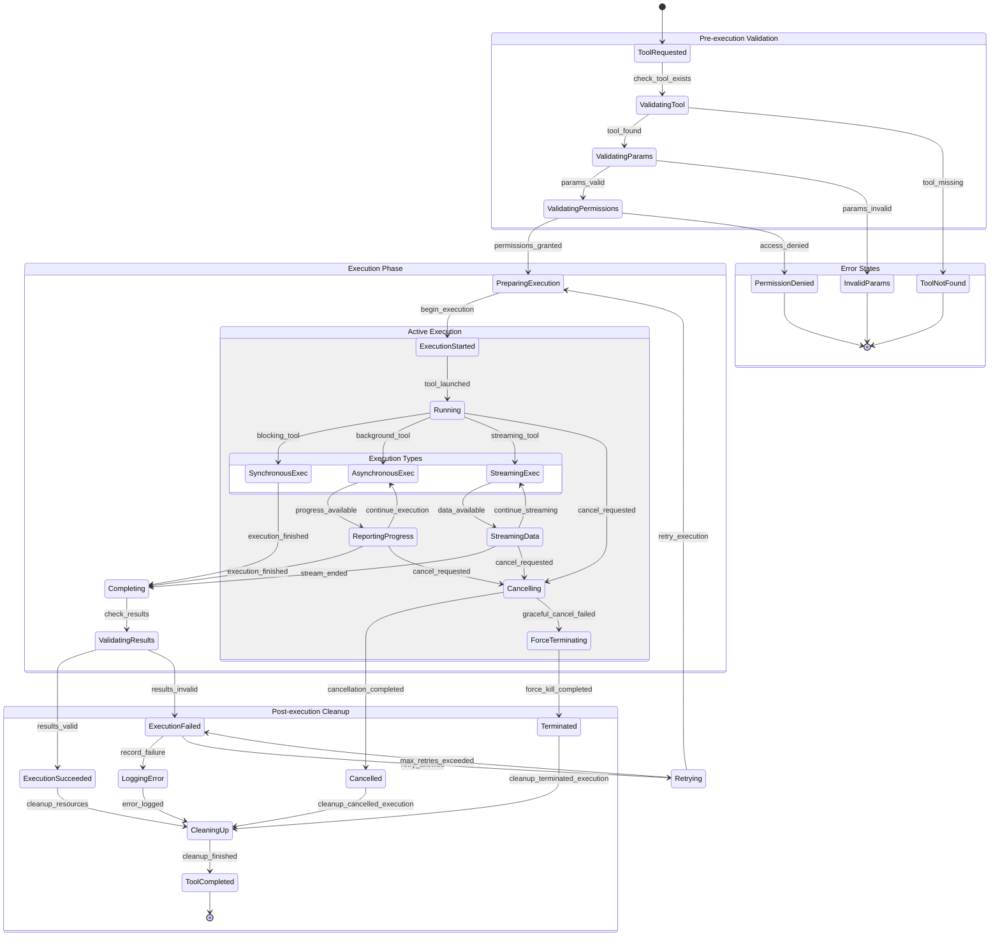
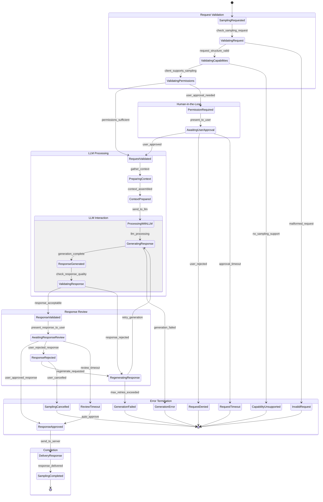
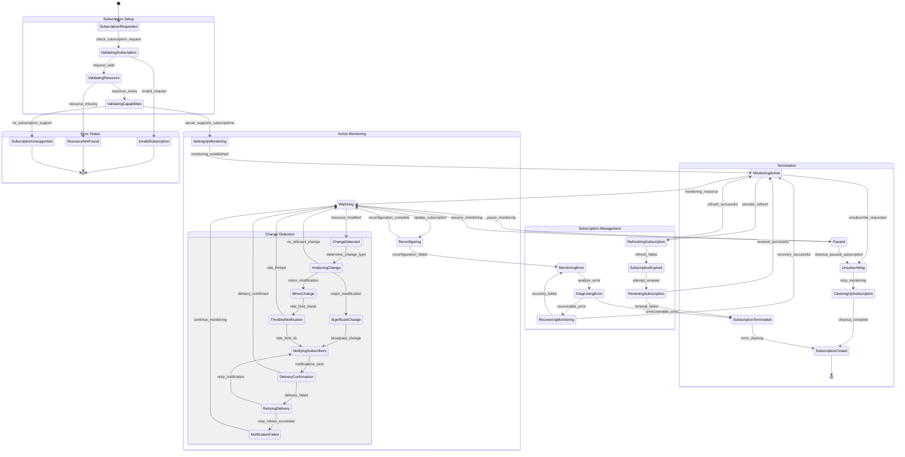

This document provides detailed state machine diagrams that illustrate the various states and transitions within the MCP ecosystem, covering connection lifecycles, capability states, and operational modes.

## Connection Lifecycle States

### Master Connection State Machine

### Capability State Management

## Resource Management States

### Resource Lifecycle State Machine

### Tool Execution State Machine

## Sampling Request State Machine

### LLM Sampling Workflow States

## Subscription Management States

### Resource Subscription Lifecycle

This comprehensive state machine documentation covers all major operational states within the MCP ecosystem, providing clear visibility into system behavior, transitions, and error handling at every level of the architecture.
